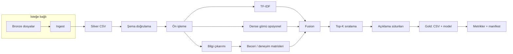

# Mevcut durum ve teknik mimari

Bu belge, **cv-matching-data-mining** projesinin güncel (v0.2 çevresi) yapısını, bileşenlerini ve çalışma biçimini özetler. Uzun vadeli geliştirme için “nereden başlanır?” sorusunun tek kaynağıdır.

---

## 1. Ürün özeti

**Amaç:** CV metinleri ile iş ilanı metinleri arasında çok kanallı skor üretmek, adayları ilan bazında sıralamak ve (isteğe bağlı) açıklanabilir çıktı vermek.

**Temel yaklaşım:**

- **Lexical:** TF-IDF + kosinüs benzerliği (tüm temiz metinler üzerinde tek vektörleyici).
- **Semantic (opsiyonel):** `sentence-transformers` ile çok dilli gömüler; paket yüklü değilse kanal otomatik kapanır.
- **Yapılandırılmış:** Lexicon tabanlı beceri kümeleri → Jaccard; ilan metninden tahmini yıl gereksinimi ile CV’deki yılların uyumu.
- **Birleştirme:** Kanal bazlı min–max normalizasyonu + `config.yaml` içindeki ağırlıklarla late fusion.

---

## 2. Teknoloji yığını


| Katman         | Seçim                                                                       |
| -------------- | --------------------------------------------------------------------------- |
| Dil            | Python ≥ 3.10                                                               |
| Paketleme      | `pyproject.toml` + `setuptools`, editable kurulum `pip install -e ".[dev]"` |
| Veri işleme    | `pandas`, `pydantic` (şema doğrulama)                                       |
| ML / metin     | `scikit-learn` (TF-IDF), isteğe bağlı `sentence-transformers` + `torch`     |
| NLP yardımcı   | `nltk` (stopword / lemmatization; ilk çalıştırmada indirme)                 |
| Belge çıkarımı | `pypdf`, `python-docx`                                                      |
| Test           | `pytest`                                                                    |
| CI             | GitHub Actions: `pytest` + `python main.py --no-semantic`                   |


---

## 3. Dizin ve kod haritası

```
cv-matching-data-mining/
├── main.py                 # CLI giriş noktası
├── config/config.yaml      # Tüm operasyonel parametreler
├── data/                   # Bronze / Silver / Gold / evaluation (data/README.md)
├── artifacts/runs/         # Deney manifestleri (gitignore; yeniden üretilir)
├── src/
│   ├── pipeline/orchestrator.py   # Uçtan uca akış
│   ├── ingest/                  # Bronze → Silver
│   ├── schemas/                 # Pydantic şemaları
│   ├── preprocessing/           # TextCleaner, tokenizer
│   ├── extraction/              # Beceri / deneyim / ilan yıl gereksinimi
│   ├── features/                # TF-IDF, semantic_encoder
│   ├── scoring/                 # Fusion, açıklama metinleri
│   ├── models/                  # Kosinüs, sıralama, explain birleştirme
│   ├── evaluation/              # Top-K, precision@K, NDCG, MRR, MAP
│   └── utils/                   # config, experiment manifest, logging
├── tests/
├── notebooks/              # Keşif / deneysel notlar
└── docs/                   # Bu belge ve diğer dokümanlar
```

**Modül sorumlulukları (kısa):**

- `orchestrate`: ingest tetikleme, okuma, özellik üretimi, fusion, yazma, metrik loglama, manifest.
- `ingest`: Ham dosyadan CSV; `CleanDocument` ile satır doğrulama.
- `scoring.fusion`: Kanal matrisleri ve ağırlıklı birleşim.
- `models.matcher`: Top-K sıra + kanal skorlarını satıra dökme + açıklama sütunları.

---

## 4. Veri ve çıktı akışı

1. **Bronze:** `data/bronze/cvs/`, `data/bronze/job_descriptions/` — ham dosyalar.
2. **Ingest:** `main.py --ingest` veya `python -m src.ingest` → `data/silver/cleaned_*.csv`.
3. **Pipeline:** Silver CSV okunur → ön işleme → TF-IDF fit/transform → (opsiyonel) dense → fusion → `data/gold/rankings/*.csv` + `data/gold/models/tfidf_model.pkl`.
4. **Değerlendirme:** `data/evaluation/ground_truth.csv` varsa offline metrikler loglanır.
5. **İzlenebilirlik:** `artifacts/runs/<UTC>/manifest.json` — config özeti, artifact yolları, girdi dosyası hash’leri (varsa), metrikler.

Şema beklentileri:

- Silver: `cv_id`, `text` / `job_id`, `text`.
- Ground truth: `cv_id`, `job_id`, `relevant` ∈ {0,1}.

### 4.1 Pipeline akış şeması (mantıksal)




Rapor teslimi ve **geri beslemenin neden bulunmadığına** dair gerekçeli metin: [reports/PIPELINE_VE_GERI_BESLEME_RAPORU.md](reports/PIPELINE_VE_GERI_BESLEME_RAPORU.md).

---

## 5. Yapılandırma (`config/config.yaml`)

Önemli bloklar: `paths`, `ingest`, `preprocessing`, `tfidf`, `embeddings`, `fusion`, `matching`, `evaluation`, `pipeline`, `experiment`, `logging`. Ortam veya deney değişimi **kod yerine YAML** üzerinden yapılmalıdır.

---

## 6. Kalite kapıları (bugünkü hali)

- Birim testleri: `tests/` (fusion, şema, sıralama metrikleri).
- CI: hızlı pipeline (`--no-semantic`) ile regresyon kontrolü.
- Üretilen artefaktlar: `.gitignore` ile depo dışında tutulanlar (`*.pkl`, `artifacts/runs/` vb.) tanımlı.

---

## 7. Bilinen sınırlar (şeffaflık)

- Öğrenilmiş rerank / cross-encoder yok; fusion ağırlıkları manuel.
- Beceri çıkarımı lexicon + hafif alias; NER / ontoloji yok.
- Türkçe morfoloji için özel kütüphane yok; çok dilli gömü kanalı pratikte güçlü sinyal.
- Ground truth örnek seti küçük; üretim öncesi etiket protokolü genişletilmeli.
- API, kimlik doğrulama ve oran sınırlama yok (batch/CLI odaklı).

---

## 8. İlgili belgeler


| Belge                                                                                    | İçerik                                         |
| ---------------------------------------------------------------------------------------- | ---------------------------------------------- |
| [reports/PIPELINE_VE_GERI_BESLEME_RAPORU.md](reports/PIPELINE_VE_GERI_BESLEME_RAPORU.md) | Pipeline şeması + geri besleme analizi (rapor) |
| [YOL_HARITASI.md](YOL_HARITASI.md)                                                       | Öncelikli geliştirme planı                     |
| [GELISTIRME_VE_SURDURULEBILIRLIK.md](GELISTIRME_VE_SURDURULEBILIRLIK.md)                 | Süreç, sürümleme, işletme                      |
| [KVKK_VE_GUVENLIK.md](KVKK_VE_GUVENLIK.md)                                               | Kişisel veri ve loglama                        |
| [PROJE_DEGERLENDIRME_VE_IDEAL_MIMARI.md](PROJE_DEGERLENDIRME_VE_IDEAL_MIMARI.md)         | Tasarım gerekçesi ve ideal resim               |


---

*Son güncelleme: 2026-05 — depo yapısına göre senkron tutulmalıdır.*