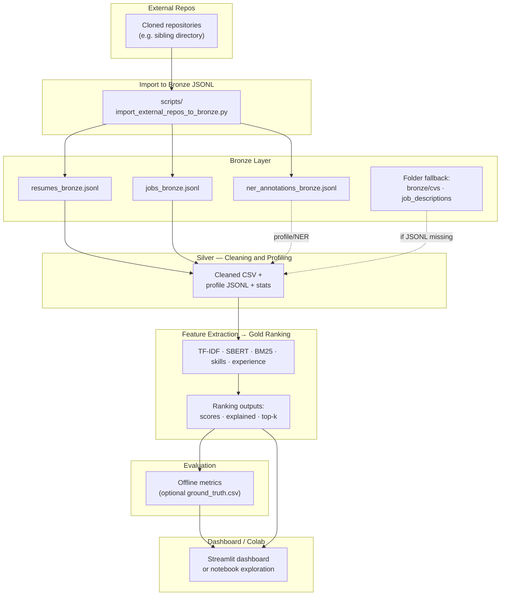

# Pipeline Diagram

End-to-end data flow for the CV–Job matching system.

## Top-level flow



---

## Explained CSV — key columns

`source`, channel scores, `skill_jaccard_score`, `cv_quality_score`,
`must_have_coverage`, `nice_to_have_coverage`, `final_score_v1`,
`final_score_v2_bm25`, `fusion_minmax_normalized_v1`,
**`score_check`**, **`score_diff`**, **`score_warning`**,
plus list and text explanation columns.

---

## Score formula — Hybrid V1 (raw channel weights)

```text
final_score_v1 ≈
  0.35 * tfidf_score +
  0.35 * semantic_score +
  0.20 * skill_score +
  0.10 * experience_score
```

Weights are read from `config/config.yaml` (`fusion.weights`).
`ranking_score` is produced by per-job min–max normalisation of channels before fusion;
`fusion_minmax_normalized_v1` reports that value separately.

---

## Hybrid V2 + BM25 (raw channel weights)

```text
final_score_v2_bm25 =
  0.25 * tfidf +
  0.25 * semantic +
  0.20 * bm25 +
  0.20 * skill +
  0.10 * experience
```

---

## Key commands

| Goal                          | Command                                                                                |
| ----------------------------- | -------------------------------------------------------------------------------------- |
| External repos → Bronze JSONL | `python scripts/import_external_repos_to_bronze.py --source-root .. --all --overwrite` |
| Bronze → Silver               | `python main.py --ingest`                                                              |
| Quick baseline                | `python main.py --no-semantic`                                                         |
| Semantic pipeline             | `python main.py --semantic`                                                            |
| Hybrid V2 + BM25              | `python main.py --semantic --bm25`                                                     |
| Evaluation (optional GT)      | `python main.py --evaluate`                                                            |
| Model comparison CSV          | `python main.py --export-eval-csv`                                                     |
| Dashboard                     | `streamlit run app/streamlit_app.py`                                                   |

---

**Related:** [VERI_YAPILARI_VE_PROFILE.md](VERI_YAPILARI_VE_PROFILE.md) (data shapes and sizes).

*Document version: 2.3 — 2026-05*
