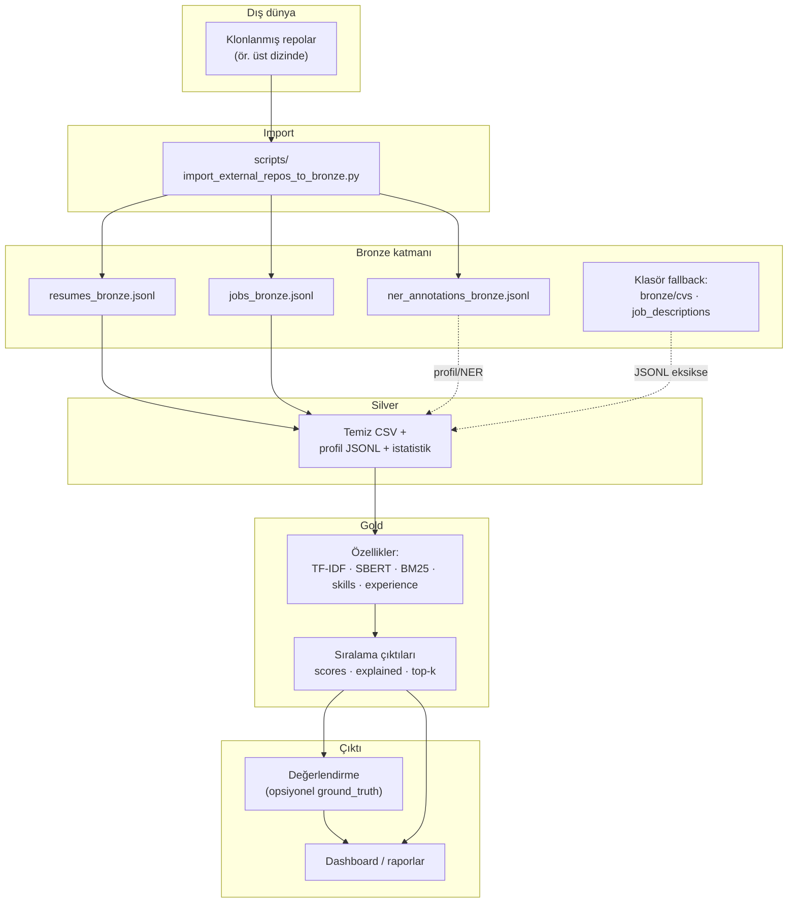

# Pipeline diyagramı

Uçtan uca veri akışı aşağıdaki **Mermaid** diyagramında özetlenir.

## Üst düzey akış



## Açıklanabilir CSV (özet kolonlar)

`source`, kanal skorları, `skill_jaccard_score`, `cv_quality_score`, `must_have_coverage`, `nice_to_have_coverage`, `final_score_v1`, `final_score_v2_bm25`, `fusion_minmax_normalized_v1`, **`score_check`**, **`score_diff`**, **`score_warning`**, liste ve metinsel açıklama kolonları.

## Skor formülü (Hybrid V1, ham bileşenler)

```text
final_score_v1 ≈ 0.35 * tfidf_score + 0.35 * semantic_score + 0.20 * skill_score + 0.10 * experience_score
```

(`config/config.yaml` ile değiştirilebilir.) `ranking_score` için kanallar iş bazında min–max ile normalize edilir; `fusion_minmax_normalized_v1` kolonu bu min–max füzyonunu raporlar.

## Hybrid V2 + BM25 (ham bileşenler)

```text
final_score_v2_bm25 =
  0.25 * tfidf + 0.25 * semantic + 0.20 * bm25 + 0.20 * skill + 0.10 * experience
```

## Önemli komutlar

| Amaç | Komut |
|------|--------|
| Dış kaynak → Bronze JSONL | `python scripts/import_external_repos_to_bronze.py --source-root .. --all --overwrite` |
| Bronze → Silver | `python main.py --ingest` |
| Hızlı baseline | `python main.py --no-semantic` |
| Semantic pipeline | `python main.py --semantic` |
| Hybrid V2 + BM25 | `python main.py --semantic --bm25` |
| Değerlendirme (GT isteğe bağlı) | `python main.py --evaluate` |
| Model karşılaştırma CSV | `python main.py --export-eval-csv` |
| Dashboard | `streamlit run app/streamlit_app.py` |

---

*Belge sürümü: 2.1 — 2026-05*
