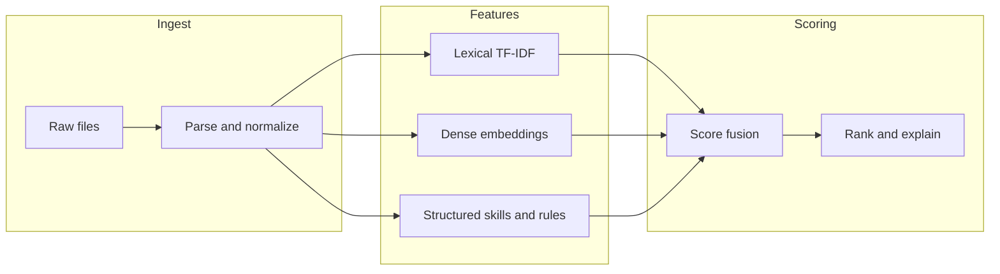

# CV–İş İlanı Eşleştirme Projesi: Teknik Değerlendirme ve İdeal Mimari

Bu belge, projeyi **kıdemli yazılım / veri analizi** perspektifinden özetler: mevcut durumun güçlü yanları, boşluklar, düzeltme ve geliştirme öncelikleri ve üretim kalitesine yaklaşan **ideal yapı** önerisi.

---

## 1. Genel bakış

Proje, klasik bir **metin madenciliği** hattı olarak doğru çerçevede: ham veriyi koruma, işlenmiş tablolar, özellik üretimi, benzerlik tabanlı sıralama ve değerlendirme kancaları. Akademik rapor metnindeki süreç (toplama → ön işleme → bilgi çıkarımı → özellik → eşleştirme → değerlendirme) ile kod klasör yapısı **uyumlu**.

Gerçek dünyada veya ders projesinde üst not için kritik nokta şudur: şu anki uygulama **iyi bir MVP (minimum uygulanabilir ürün)**; fakat **ölçülebilir kalite**, **tekrarlanabilirlik**, **çok dilli/Türkçe metin**, **etik ve önyargı**, **operasyonel izleme** ve **ürünleşme** katmanları henüz tamamlanmış değil. Bu belge bu boşlukları sistematik listeler.

---

## 2. Artılar (güçlü yanlar)

| Alan                           | Gerekçe                                                                                                                                  |
| ------------------------------ | ---------------------------------------------------------------------------------------------------------------------------------------- |
| **Modüler klasör yapısı**      | `preprocessing`, `extraction`, `features`, `models`, `evaluation`, `utils` ayrımı okunabilir ve genişlemeye uygun.                       |
| **Ham / işlenmiş ayrımı**      | `data/bronze` dokunulmaz; `data/silver` (tabular), `data/gold` (model + sıralama) ayrımı ideal mimariyle uyumlu.                         |
| **Yapılandırma dosyası**       | `config.yaml` ile parametre yönetimi; deney tekrarı için temel şart.                                                                     |
| **Uçtan uca çalışan pipeline** | `main.py` ile tek komutta akış; paylaşım ve demo için değerli.                                                                           |
| **TF-IDF + kosinüs**           | İlk baseline için hızlı, açıklanabilir ve düşük maliyetli; “neden bu aday?” sorusuna kısmi cevap verilebilir.                            |
| **Bilgi çıkarımı kancası**     | Beceri listesi ve deneyim regex’leri, raporda anlatılan “information extraction” ile uyumlu; ileride ontoloji/NER ile güçlendirilebilir. |
| **Değerlendirme iskeleti**     | Top-K ve precision@K için kod ve config alanı var; ground truth geldiğinde ölçüm yapılabilir.                                            |
| **Notebook ayrımı**            | Keşif ve deneylerin `notebooks` altında tutulması iyi pratik.                                                                            |

---

## 3. Eksiklikler ve riskler

### 3.1 Veri ve etiketleme

- **Ground truth yok veya zayıf**: Sıralama kalitesi iddia düzeyinde kalır. İdeal senaryoda her (cv, job) çifti veya en azından “bu iş için uygun adaylar” için **çok etiketçili** veya HR uzmanı etiketi gerekir.
- **Türkçe / çok dilli metin**: Config `language: en` ve NLTK İngilizce stopword/lemmatization ile hizalı. Türkçe CV ve ilanlar için **morphological analyzer** (ör. Zemberek benzeri) veya **sentence-transformers çok dilli modeller** şart; aksi halde performans düşer.
- **Ham veriden işlenmişe geçiş otomasyonu yok**: PDF/DOCX → metin → `cleaned_*.csv` adımı projede tek parça olarak tanımlı değil; tekrarlanabilirlik riski.

### 3.2 Modelleme ve bilgi çıkarımı

- **Tek sinyal (TF-IDF)**: Semantik yakınlık (“Python geliştirici” vs “yazılım mühendisi”) zayıf kalır. Raporun “semantik eksiklik” maddesi burada somutlaşır.
- **Çıkarılan beceriler skora bağlanmıyor**: `skills` ve `exp_years` üretiliyor fakat **matching skoruna** katkı vermiyor; modüller arası entegrasyon yarım.
- **Skill lexicon statik**: Synonym (“ML” / “machine learning”), yazım varyantları ve sektörel jargonda **recall** düşük kalır.
- **Deneyim eşlemesi yok**: İlanda “3+ yıl” ile CV’deki yılların **kısıt olarak** kullanılması (hard/soft filter) yok.

### 3.3 Mühendislik ve ürünleşme

- **Test yok**: Birim testi veya entegrasyon testi olmadan regresyon riski yüksek.
- **Logging ve izlenebilirlik**: Hangi sürüm config, hangi veri hash’i, hangi model dosyası kullanıldığı loglanmıyor.
- **Bağımlılık sabitleme**: `pyproject.toml` ile sürüm tabanları tanımlı; **lock dosyası** (ör. `uv.lock` / `poetry.lock`) yok; ortam farkları sonuçları değiştirir.
- `**sys.path` ile paket yükleme**: `main.py` kök dizini path’e ekliyor; idealde `pip install -e .` ile **paket** olarak kurulum.

### 3.4 Değerlendirme metrikleri

- **Top-K “job hit rate”** tanımı basit; raporda geçen Precision/Recall ile **NDCG**, **MRR**, **MAP** gibi sıralama metrikleri daha standarttır.
- **Pozitif örnek dengesizliği**: Çoğu (cv, job) çifti negatif olacağından metrik seçimi dikkat ister.

### 3.5 Güvenlik, adalet, KVKK

- CV verisi **kişisel veri**dir: saklama süresi, erişim, anonimleştirme, loglarda ham metin taşınmaması gibi konular dokümante değil.
- Model ve skorlar **cinsiyet, yaş, okul** gibi vekil değişkenler üzerinden dolaylı ayrımcılık üretebilir; risk analizi yok.

---

## 4. Düzeltilmesi ve geliştirilmesi gerekenler (öncelik sırası)

**P0 — Ölçüm ve veri**

1. Küçük ama gerçekçi bir **etiket seti** (ör. 50–200 iş ilanı, her biri için 3–10 uygun/uygunsuz CV) ve bununla haftalık regression.
2. Ham dosyadan `cleaned_*.csv` üreten **tek komutluk** ingest modülü + veri şeması doğrulama (pandera / pydantic).

**P1 — Model**

1. İkinci bir skor kanalı: **yoğun gömüler** (ör. `sentence-transformers` çok dilli) + TF-IDF ile **late fusion** veya öğrenilmiş ağırlıklar.
2. Beceri çıkarımını skora bağlama: **Jaccard / embedding overlap** veya öğrenilmiş **feature** olarak birleştirme.

**P2 — Mühendislik**

1. `pyproject.toml` + düzenli paket yapısı, `pytest`, CI (GitHub Actions).
2. Deney takibi: MLflow veya basit `runs/` klasörü (config hash, metrik, artifact yolu).

**P3 — Ürün ve uyumluluk**

1. KVKK kısa risk dokümanı; PII maskeleme; üretim API’sinde rate limit ve audit log taslağı.

---

## 5. İdeal mimari (hedef resim)

Aşağıdaki katmanlar, projeyi “ders ödevi”nden “güvenilir bir sisteme” taşır.

### 5.1 Veri platformu

- **Bronze**: Ham dosyalar (PDF/DOCX/TXT) + metadata (kaynak, tarih, hash).
- **Silver**: Normalize metin, dil tespiti, PII redaksiyonu (isteğe bağlı), tutarlı şema.
- **Gold**: Özellik vektörleri, model artifact’ları, sıralama çıktıları (versiyonlu).

Bu depodaki dizin eşlemesi: `**data/bronze/`** (ham), `**data/silver/`** (CSV şema), `**data/gold/models`** ve `**data/gold/rankings`**, etiketler `**data/evaluation/**`; çalıştırma manifestleri `**artifacts/runs/**`.

Her katman için **immutability** (üzerine yazmak yerine yeni partition) ve **lineage** (hangi ham dosyadan üretildi) izlenir.

### 5.2 Özellik ve model servisleri

- **Lexical**: TF-IDF veya BM25 (ilan–CV eşleşmesinde BM25 sık tercih edilir).
- **Dense**: Çok dilli sentence embeddings; domain fine-tuning veya contrastive learning ile güçlenir.
- **Structured**: Beceri grafiği, yıl kısıtları, lokasyon, çalışma şekli gibi **tabular** sinyaller.
- **Fusion**: Basit başlangıç: ağırlıklı toplam; ileri: **learning to rank** (XGBoost/LightGBM) veya cross-encoder reranking.

### 5.3 Açıklanabilirlik

İdeal çıktı yalnızca `score` değil; örneğin:

- Eşleşen üst terimler / beceriler,
- Eksik ama ilanda istenen beceriler,
- Deneyim bandı uyarısı.

Bu, HR güveni ve hata ayıklama için kritiktir.

### 5.4 Değerlendirme düzeni

- **Offline**: NDCG@K, MRR, MAP; segment bazlı (dil, pozisyon ailesi).
- **Online** (ileride): A/B, tıklama, mülakat daveti, işe alım sonucu ile kalibrasyon.

### 5.5 Operasyon

- Model ve veri **versiyonlama** (DVC veya registry),
- Geri alma (rollback) stratejisi,
- Gözlemlenebilirlik: gecikme, hata oranı, skor dağılımı drift’i.

---

## 6. Mevcut kod tabanı ile ideal yapı arasındaki fark (özet)

| Bileşen       | Şu an                         | İdeal                                         |
| ------------- | ----------------------------- | --------------------------------------------- |
| Ingest        | Bronze→Silver otomatik + şema | Partition/hash ile tam lineage (ileride DVC)  |
| Dil           | İngilizce odaklı              | Dil tespiti + TR/EN pipeline                  |
| Skor          | TF-IDF kosinüs                | Çok kanallı + fusion + opsiyonel rerank       |
| Beceri        | Lexicon                       | Ontoloji / NER + skora bağlı                  |
| Test          | pytest + CI                   | Genişletilmiş entegrasyon / sözleşme testleri |
| Değerlendirme | Basit Top-K                   | NDCG/MRR + raporlama                          |
| Güvenlik      | Tanımsız                      | PII, erişim, denetim                          |

---

## 7. Sonuç

Proje, **akademik rapor ve klasik veri madenciliği süreci** ile uyumlu, anlaşılır bir baseline sunuyor. Güçlü tarafı yapı ve uçtan uca çalışabilirlik; zayıf tarafı ise **ölçüm**, **çok dilli gerçek veri**, **semantik katman**, **çıkarılan bilginin skora entegrasyonu** ve **mühendislik disiplininin** (test, paketleme, izlenebilirlik) tamamlanmamış olması.

Bu belgedeki **P0–P3** maddeleri sırayla uygulandığında, proje hem not/rapor hem de “gerçek dünyaya bir adım daha yakın” bir sistem haline gelir.

---

*Belge tarihi: 2026-05-04 — `cv-matching-data-mining` deposundaki mevcut yapıya göre hazırlanmıştır.*

---

## Ek: v0.2 ile uygulanan maddeler (özet)

Aşağıdakiler kod tabanına işlendi; ideal mimarinin tamamı (ör. üretim API’si, DVC) hâlâ isteğe bağlıdır.

| Öncelik | Madde                  | Uygulama                                                                                   |
| ------- | ---------------------- | ------------------------------------------------------------------------------------------ |
| P0      | Etiket seti            | `data/evaluation/ground_truth.csv` + `config.paths.ground_truth`                           |
| P0      | Ingest + şema          | `src/ingest/` (Bronze→Silver), `src/schemas/`, `python -m src.ingest` / `main.py --ingest` |
| P1      | Yoğun gömü + fusion    | `src/features/semantic_encoder.py`, `src/scoring/fusion.py`, `fusion.weights`              |
| P1      | Beceri / deneyim skoru | `skill_jaccard_matrix`, `experience_match_matrix`, açıklama sütunları                      |
| P2      | Paket + test + CI      | `pyproject.toml`, `pytest`, `.github/workflows/ci.yml`                                     |
| P2      | Deney izi              | `artifacts/runs/*/manifest.json` (`experiment.write_manifest`)                             |
| P3      | KVKK özeti             | `docs/KVKK_VE_GUVENLIK.md`                                                                 |
| —       | Sıralama metrikleri    | `NDCG@K`, `MRR`, `MAP` (`src/evaluation/ranking_metrics.py`)                               |

---

## Ek: Operasyonel dokümantasyon

Güncel mimari ve ileriye dönük plan: [MEVCUT_DURUM_VE_MIMARI.md](MEVCUT_DURUM_VE_MIMARI.md), [YOL_HARITASI.md](YOL_HARITASI.md), [GELISTIRME_VE_SURDURULEBILIRLIK.md](GELISTIRME_VE_SURDURULEBILIRLIK.md).