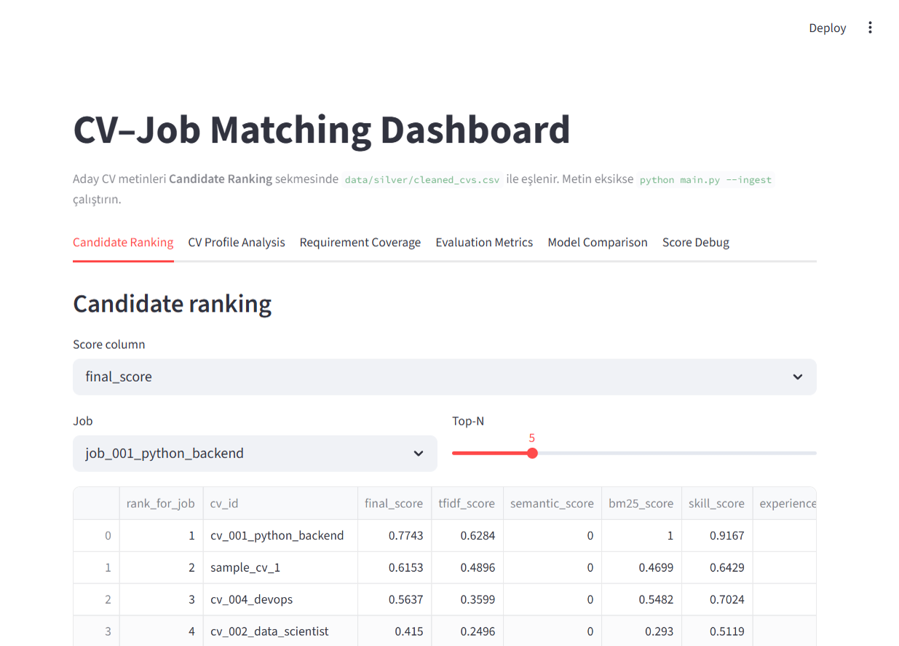
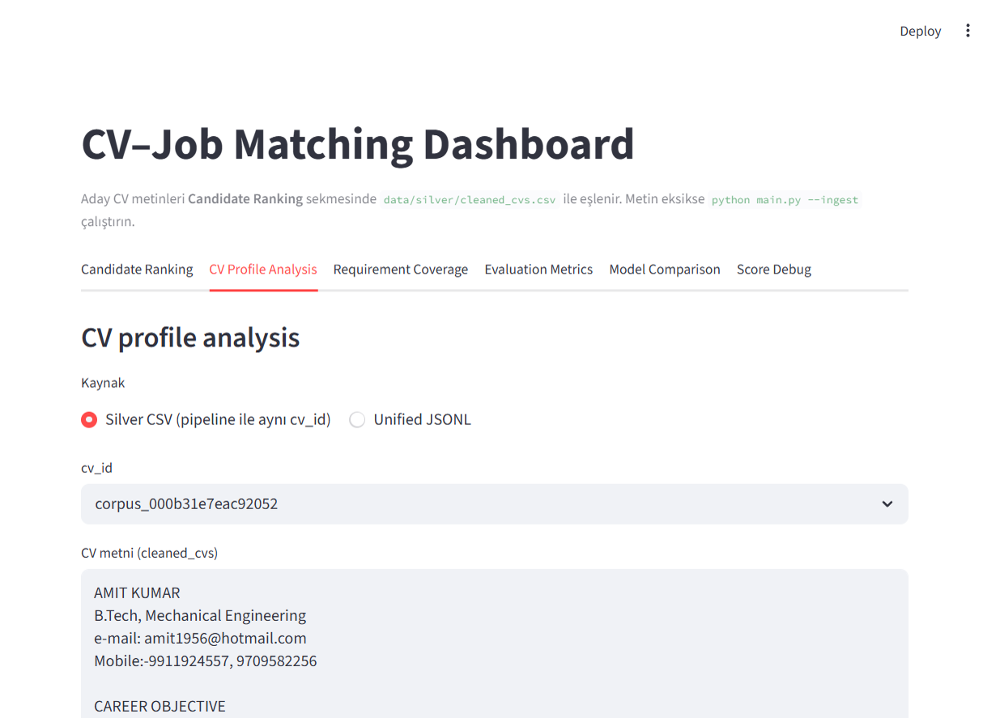
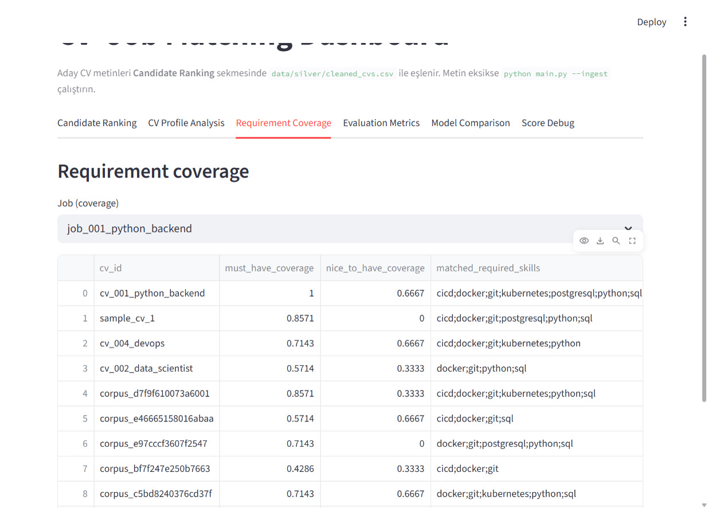
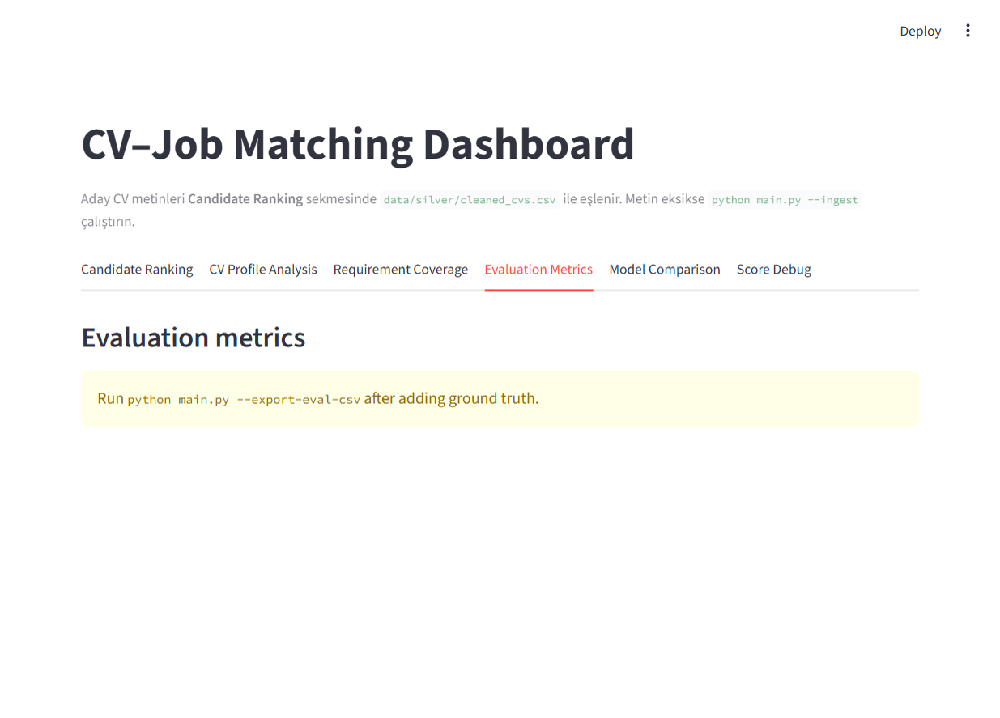
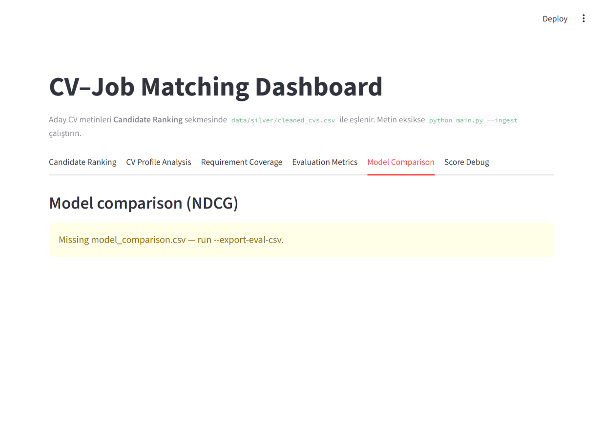
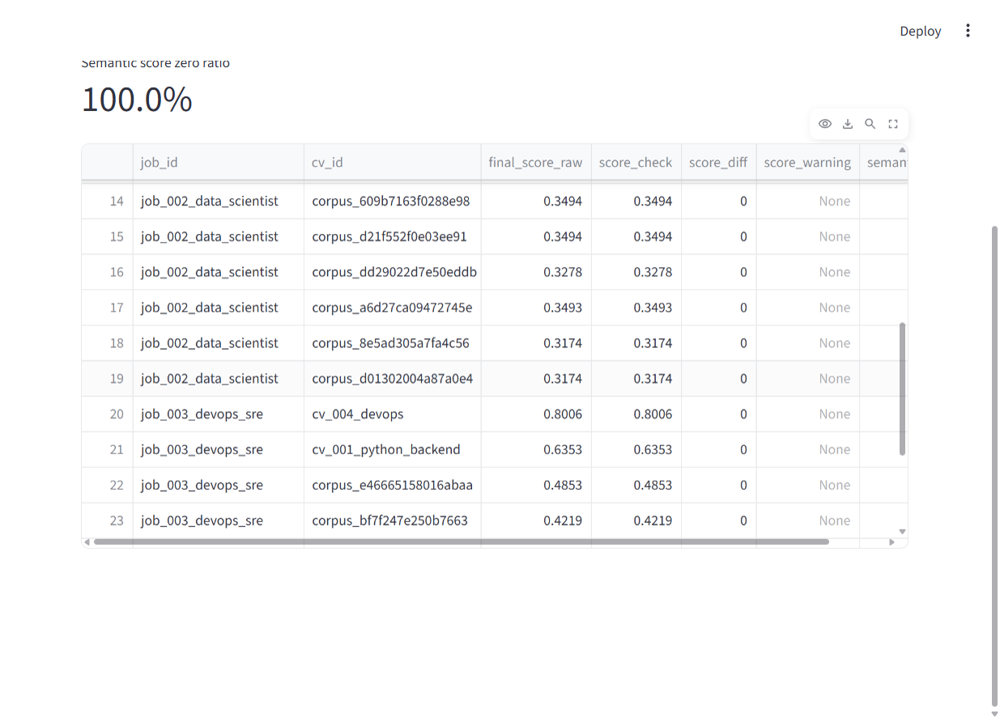

# Tesla Delivery Pack — Technical Appendix (EN) & Speaker Notes (TR)

**Companion document to:** `docs/TESLA_TEKNIK_DEGERLENDIRME_RAPORU.md`  
**Solution:** `cv-matching-data-mining` v0.3.0  
**Date:** 9 May 2026  

This file contains two parts in one place:

1. **Part I — Tesla Technical Appendix** (English): concise technical addendum suitable for engineering due diligence.  
2. **Part II — 10-slide speaker notes** (Turkish): what to say, slide by slide.

---

# Part I — Tesla Technical Appendix (English)

## Document purpose

This appendix summarizes the **architecture**, **quantitative pilot results**, **limitations**, and **integration posture** of the CV–job hybrid matching pipeline delivered in the `cv-matching-data-mining` repository. It is intended for Tesla engineering, data science, security, and HR technology stakeholders ahead of a proof-of-concept or procurement discussion.

## Product definition

The system is an **offline, batch analytics engine** that:

- Ingests raw resumes and job descriptions (PDF, DOCX, TXT, MD).
- Produces **Silver** CSVs (`cv_id` / `job_id` + full text).
- Builds **multi-channel similarity matrices** between every CV and every job in scope.
- Applies **late fusion** (per-job min–max normalization, then weighted sum).
- Emits **top-K rankings** plus an **explainable** CSV with per-channel scores and natural-language rationale fields.
- Optionally runs **offline ranking metrics** when a labeled `ground_truth.csv` is supplied.

It is **not** a drop-in replacement for a full ATS stack; default packaging is **CLI + optional Streamlit dashboard + CSV artifacts**. A service layer (REST/gRPC), identity (SSO), and enterprise data plane would be a separate integration phase.

## System architecture

### Medallion-style data layers

| Layer | Location (example) | Role |
|--------|---------------------|------|
| Bronze | `data/bronze/cvs`, `data/bronze/job_descriptions` | Immutable-ish raw files |
| Silver | `data/silver/cleaned_cvs.csv`, `cleaned_jobs.csv` | Extracted plain text |
| Silver+ | `data/silver/unified_resumes.jsonl` (optional) | Enriched profiles (sections, skills, quality score) |
| Gold | `data/gold/rankings/*.csv`, `data/gold/models/` | Rankings and fitted TF-IDF artifact |
| Provenance | `artifacts/runs/<UTC>/manifest.json` | Config hash, input file hashes, metrics snapshot |

### Scoring channels

All channels produce a dense matrix of shape **(n_cvs, n_jobs)**:

1. **Lexical TF–IDF** — `TfidfFeatureBuilder` + cosine similarity (clipped to [0, 1]).
2. **BM25** (optional) — `rank_bm25`–based job–query style scoring (config / CLI).
3. **Dense embeddings** (optional) — Sentence-Transformers encoder; default model name in `config/config.yaml`. If the encoder cannot load, the channel is disabled and weights are re-normalized.
4. **Structured skills** — YAML lexicon (`config/skills.yaml`), must/nice requirements from job text, coverage and Jaccard-style summaries for reporting.
5. **Experience** — Regex-derived year signals; soft match score vs. job-stated minimum years.

Fusion is implemented in `src/scoring/fusion.py` (`fuse_scores`, optionally `fuse_weighted_raw` for audit columns). **Fusion V2** adds BM25 when enabled.

### Explainability

`src/models/matcher.py` enriches ranked rows with:

- Must-have / nice-to-have coverage.
- Matched and missing skill IDs (with display names where available).
- Experience notes and free-text **explanation** / **suggested_improvements** fields (`src/scoring/explain.py`).

### Optional second stage

`src/models/cross_encoder_rerank.py` re-scores top-N pairs with a cross-encoder and blends with the baseline fused score (`--rerank` in `main.py`).

### Privacy controls

When `privacy.anonymize` is true, `src/preprocessing/pii.py` masks common PII patterns (email, URL, phone-like strings, Turkish address-like snippets) **before** scoring. This reduces **contact leakage** into similarity signals; it does **not** by itself constitute full GDPR compliance or a completed DPIA.

### Engineering quality signals

- **Pydantic** configuration validation (`src/config/schema.py`) at startup.
- **pytest** suite under `tests/`.
- **GitHub Actions** CI: install dev extras, run tests, smoke `python main.py --no-semantic`.

## Quantitative inventory (this workspace snapshot)

Figures below are **measured from files in this repository copy**. They describe our **reference demo / pilot** and must not be interpreted as Tesla production guarantees.

| Item | Value | Source |
|------|--------|--------|
| Processed CV rows (Silver) | **4,005** | `data/silver/cleaned_cvs.csv` (logical CSV record count) |
| Processed job rows (Silver) | **3** | `data/silver/cleaned_jobs.csv` |
| Full Cartesian scoring pairs | **12,015** | 4,005 × 3 |
| Explained ranking output rows (top-K=10, 3 jobs) | **30** | `candidate_scores_explained.csv` |
| Unified JSONL corpus records | **9,484** total; **9,263** OK | `unified_resumes.jsonl.stats.json` |
| Canonical skill entries (lexicon) | **~48** | `config/skills.yaml` |
| Labeled evaluation pairs | **12** | `data/evaluation/ground_truth.csv` |
| Jobs covered by labels | **3** | Same file |

### Pilot offline metrics (reference run)

Run ID: `artifacts/runs/20260508T204457Z/manifest.json`

**Notes field:** `dense_enabled: false`, `bm25_enabled: true`.

| Metric | @1 | @3 | @5 |
|--------|-----|-----|-----|
| Top-K hit rate (any relevant in top-K) | 1.000 | 1.000 | 1.000 |
| Precision | 1.000 | 0.556 | 0.400 |
| Recall | 0.389 | 0.667 | 0.778 |
| NDCG (graded) | 1.000 | 0.922 | 0.937 |
| **MRR** | — | — | **1.000** |

**MAP (Mean Average Precision, averaged across labeled jobs):** **0.713**

**Interpretation guardrail:** Metrics are computed over **three jobs** and **twelve graded pairs**. Statistical power is low; results validate **pipeline wiring and ranking behavior on a controlled pilot**, not generalization at Tesla scale.

A contrasting configuration (`20260506T072909Z`) shows **lower** NDCG@5 (~0.484) and MAP (~0.309) on the **same** tiny label set, illustrating **sensitivity to weights and enabled channels**. Final Tesla performance requires **Tesla-specific labels and A/B tests**.

## Tesla-facing deployment considerations

- **Scale:** Full dense matrices are O(N_cv × N_jobs). At very large N, move to **two-stage retrieval** (BM25 / ANN candidate generation + cross-encoder rerank) while preserving manifest and explainability patterns.
- **Domain lexicon:** Extend `skills.yaml` with Tesla domains (e.g., embedded software, functional safety, battery systems, manufacturing IT). This is often the highest ROI change before swapping base encoders.
- **MLOps:** Extend `manifest.json` with **model name, version, and training data snapshot IDs** to meet internal audit expectations.
- **HR ethics:** Outputs are **decision support** only; human review remains mandatory for adverse actions.

## Module map (quick reference)

| Concern | Primary module |
|---------|----------------|
| CLI entry | `main.py` |
| Pipeline orchestration | `src/pipeline/orchestrator.py` |
| Feature construction | `src/pipeline/matching_inputs.py` |
| Fusion | `src/scoring/fusion.py` |
| Ranking + explanations | `src/models/matcher.py`, `src/scoring/explain.py` |
| Metrics | `src/evaluation/metrics.py`, `src/evaluation/ranking_metrics.py` |
| Run provenance | `src/utils/experiment.py` |
| UI | `app/streamlit_app.py` |

## UI screenshots (Streamlit dashboard)

Captured from `streamlit run app/streamlit_app.py` while `candidate_scores_explained.csv` is present. Assets live under `docs/screenshots/` (paths below are relative to this `docs/` folder).

| # | Tab | File |
|---|-----|------|
| 1 | Candidate Ranking | `screenshots/01-candidate-ranking.jpeg` |
| 2 | CV Profile Analysis | `screenshots/02-cv-profile.jpeg` |
| 3 | Requirement Coverage | `screenshots/03-requirement-coverage.jpeg` |
| 4 | Evaluation Metrics | `screenshots/04-evaluation-metrics.jpeg` |
| 5 | Model (NDCG) comparison | `screenshots/05-model-comparison.jpeg` |
| 6 | Score debug | `screenshots/06-score-debug.jpeg` |

*Note:* Evaluation and model-comparison panes show instructions until `evaluation_results.csv` / `model_comparison.csv` are produced via `python main.py --export-eval-csv`. The score-debug view may show **100%** semantic-zero ratio when the dense channel was disabled for that run.

## Separate data asset (workspace root)

The parent workspace `cv_analysis/README.md` describes a **NER-oriented resume training corpus** (~5,960 samples in one merged split). Licensing and scope are **independent** of the matching pipeline and must be reviewed if bundled commercially.

---

# Part II — 10 slaytlık konuşmacı notları (Türkçe)

Sunum süresi varsayımı: **20–25 dakika** + soru–cevap. Her slayt için “söylenecekler” ve isteğe bağlı **ekran göstergesi**.

---

## Slayt 1 — Başlık ve gündem

**Söylenecekler**

- Bugün Tesla mühendislik ve İK paydaşlarına **aday–ilan eşleştirme** için kurduğum **çok kanallı, açıklanabilir** bir motoru anlatıyorum.
- Çıktı: ölçülebilir sıralama + **kanal bazlı skorlar** + İK’nın kullanabileceği **metinsel gerekçe** alanları.
- Sunum yapısı: ne sunuyoruz → mimari → rakamlar → riskler ve Tesla yol haritası.

**Ekran:** Logo, ürün adı, “Decision support — not autonomous hiring.”

---

## Slayt 2 — Problem: Ölçek ve tutarlılık

**Söylenecekler**

- Yüksek hacimde CV ve ilan metni var; sadece anahtar kelime veya tek skor **hem adaleti hem verimi** zorlaştırır.
- İhtiyaç: **tekrarlanabilir** ön sıralama, mühendislik diline uygun sinyaller, **denetlenebilir** konfigürasyon.
- Bizim çözüm **batch / offline** bir motor: mevcut ATS’nin yerine geçmek zorunda değil; **üstüne veya yanına** konur.

**Ekran:** “Pain → requirement” madde işaretleri.

---

## Slayt 3 — Çözüm özeti (30 saniye pitch)

**Söylenecekler**

- **Lexical:** TF‑IDF, isteğe bağlı BM25.  
- **Semantic:** sentence-transformers (açılabilir/kapanabilir).  
- **Structured:** beceri sözlüğü + ilan gereksinimi (must / nice).  
- **Deneyim:** yıl sinyalleri.  
- Hepsi **geç füzyon** ile birleşir; ilan başına **top‑K** çıkar.

**Ekran:** Dört kutu + “Fusion” ok diyagramı.

---

## Slayt 4 — Veri katmanları (Bronze → Gold)

**Söylenecekler**

- Ham dosya **Bronze**; metin çıkarılmış tablo **Silver**; sıralama ve modeller **Gold**.  
- İsteğe bağlı **JSONL** ile geniş profil analizi ve korpus genişletme.  
- Her koşumda **manifest**: config hash, girdi hash’leri, metrikler — **denetim izi**.

**Ekran:** Medallion şeması (tablo veya basit diyagram).

---

## Slayt 5 — Arka planda pipeline (tek şema)

**Söylenecekler**

1. `ingest`: PDF/DOCX/TXT/MD → CSV.  
2. Opsiyonel **PII maskeleme** skordan önce.  
3. Ön işleme (cleaner).  
4. Kanal matrisleri → normalize → ağırlıklı toplam.  
5. Sıralama + **açıklama** sütunları.  
6. İsteğe bağlı **cross‑encoder rerank** (ikinci aşama kalite).

**Ekran:** Yatay akış; “PII before scoring” vurgusu.

---

## Slayt 6 — Sayılar: Bu kopyadaki ölçek

**Söylenecekler**

- **4.005** CV, **3** ilan → tam skor matrisi **12.015** çift.  
- Birleşik korpus istatistiği: **9.484** kayıt (**9.263** başarılı) — ayrı analiz/NLP senaryoları.  
- Beceri sözlüğü: **~48** kanonik skill; Tesla’da **genişletme** beklenir.

**Ekran:** Büyük puntolu rakamlar + “pilot workspace” dipnotu.

---

## Slayt 7 — Başarım: Pilot ground truth ile ölçüm

**Söylenecekler**

- Etiket seti **küçük**: **12** dereceli çift, **3** ilan — dürüst olun: bu **genelleme** değil, **doğrulama** demek.  
- Referans koşu: **MRR 1.0**, **NDCG@5 ~0.94**, **MAP ~0.71** (semantic kapalı, BM25 açık).  
- Başka konfigürasyonda NDCG düşebiliyor — **Tesla verisinde** yeniden ölçüm şart.

**Ekran:** Küçük tablo + büyük uyarı kutusu: “Pilot labels — not Tesla production claim.”

---

## Slayt 8 — Açıklanabilirlik ve İK değeri

**Söylenecekler**

- Her satırda: TF‑IDF, semantic, BM25, skill, experience skorları mümkün olduğunca ayrık.  
- **Eşleşen / eksik beceriler**, deneyim notu, **önerilen iyileştirmeler** — mülakata hazırlık ve geri bildirim dili.  
- İnsan kararı yerine geçmiyoruz: **karar destek**.

**Ekran:** Örnek satır (CSV kesiti veya mock-up).

---

## Slayt 9 — Güvenlik, etik, Tesla entegrasyonu

**Söylenecekler**

- PII maskeleme **başlangıç**; Tesla’da DPIA, veri sınıflandırma, RBAC, log politikası ayrı iş paketi.  
- Ölçek büyüyünce: **iki aşamalı retrieval** (önce aday alt kümesi, sonra rerank).  
- Lexicon ve model sürümlerini registry ile sabitleme — mühendislik beklentisi.

**Ekran:** Üç sütun: Security / Scale / Governance.

---

## Slayt 10 — Sonraki adımlar ve kapanış

**Söylenecekler**

- Önerilen PoC: küçük Tesla ilan seti + anonimleştirilmiş profil alt kümesi + ortak **ground truth** tanımı.  
- Başarı ölçütü: İK ve hiring manager ile hizalı **NDCG / calibration** + operasyonel maliyet.  
- Kapanış: Şeffaf mimari, **kanıtlanabilir koşumlar**, Tesla verisinde **ölçülerek** büyüyen yol.

**Ekran:** PoC zaman çizelgesi (2–4 hafta örnek); iletişim / teknik kontak.

---

## Konuşmacı için hazır kapanış cümlesi (İngilizce opsiyonel)

“We’re not selling a black box. We’re offering a **multi-signal, explainable ranking pipeline** with **provenance manifests** and a clear path to **Tesla-scale retrieval**. The numbers will be **yours** once we score them on **your** labeled data.”

---

*End of document.*
