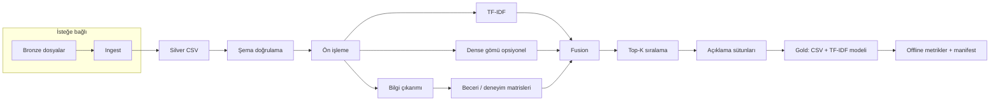

# Pipeline yapısı ve geri besleme analizi

**Kapsam:** cv-matching-data-mining projesi — teknik özet raporu.  
**Amaç:** Uçtan uca akışın şematik gösterimi ve sistemin neden kapalı döngü (geri besleme) içermediğinin gerekçelendirilmesi.

---

## 1. Pipeline akış şeması (mantıksal)

Aşağıdaki diyagram, `main.py` → `run_full_pipeline` orkestrasyonunu özetler. Ok yönü tek yönlüdür: ham/ tablo verisinden sıralama çıktısına kadar **ileri akış** vardır; çıktıdan modele otomatik dönüş **yoktur** (Bölüm 3).

### 1.1 Aşama özeti

| Sıra | Aşama | Çıktı / not |
|------|--------|-------------|
| 0 | Ingest (opsiyonel) | `data/silver/cleaned_*.csv` |
| 1 | Doğrulama | Pydantic uyumlu satırlar |
| 2 | Ön işleme | `clean_text` |
| 3 | Yapılandırılmış sinyal | Beceri kümeleri, yıl matrisleri |
| 4 | Lexical | TF-IDF vektörleri, kosinüs matrisi |
| 5 | Semantic (opsiyonel) | Normalize embedding, kosinüs |
| 6 | Fusion | Ağırlıklı birleşik skor matrisi |
| 7 | Sıralama + explain | `candidate_scores*.csv` |
| 8 | Değerlendirme (opsiyonel) | Ground truth ile NDCG, MRR, MAP, … |
| 9 | İz | `artifacts/runs/*/manifest.json` |

---

## 2. Veri katmanları ile hizalama

| Katman | Rol |
|--------|-----|
| Bronze | Ham girdi; ingest kaynağı |
| Silver | İşlenmiş tablolar (metin + kimlik) |
| Gold | Model artifact ve sıralama sonuçları |
| Evaluation | Offline etiketler (`ground_truth.csv`) |

---

## 3. Geri besleme neden yok? — Gerekçeler

Bu sürümde **çıktının (skor, sıra, kullanıcı davranışı) sisteme geri beslenerek model veya ağırlıkların otomatik güncellenmesi** tasarlanmamıştır. Sebepler özetle şunlardır:

### 3.1 Tasarım kapsamı ve basitlik

- Proje **batch / CLI** odaklı bir veri madenciliği hattıdır; üretimde sürekli çalışan bir servis veya kullanıcı arayüzü varsayılmamıştır.
- Kapalı döngü (ör. tıklama, işe alım sonucu → yeniden eğitim) ek maliyet: altyapı, güvenlik, veri sözleşmesi ve MLOps disiplini gerektirir.

### 3.2 Ölçüm ve sinyal eksikliği

- **Online sinyal yoktur:** Aday listesine tıklama, “uygun / uygun değil” işaretleme, mülakat daveti gibi gerçek kullanıcı geri bildirimleri toplanmaz veya modele bağlanmaz.
- **Ground truth statiktir:** `ground_truth.csv` manuel veya dış süreçle üretilir; pipeline çalıştıkça dosya **otomatik güncellenmez**.

### 3.3 Öğrenme bileşeni yok

- TF-IDF ve fusion ağırlıkları **yapılandırma dosyasından** gelir; validation set üzerinde **otomatik hiperparametre / ağırlık optimizasyonu** yoktur.
- Dense encoder **ön öğrenmiş** modeldir; proje içinde **fine-tuning veya contrastive öğrenme** döngüsü tanımlı değildir.

### 3.4 Risk ve uyumluluk

- Geri besleme, özellikle **işe alım bağlamında**, önyargı döngüsü (bias amplification) riskini artırır; insan denetimi ve protokol olmadan otomatik güncelleme istenmez.
- KVKK / audit gereksinimleri, hangi verinin modele girdiğinin **izlenebilir** olmasını ister; bu sürümde bu iz için üretim düzeyinde süreç tanımlı değildir.

### 3.5 Özet tablo

| Neden | Açıklama |
|--------|-----------|
| Mimari | Tek yönlü batch pipeline |
| Ürün | API / UI geri bildirim hattı yok |
| Veri | Dinamik etiket veya davranış sinyali yok |
| ML | Öğrenilmiş fusion / sürekli eğitim yok |
| Güven | Otomatik kapalı döngü bilinçli olarak ertelendi |

---

## 4. İleride geri besleme nasıl eklenebilir? (yön gösterici)

Öncelik sırası [YOL_HARITASI.md](../YOL_HARITASI.md) ile uyumludur:

1. **İnsan onaylı etiketler:** HR veya uzmanın “uygun aday” işaretleri → `ground_truth` veya ayrı tabloya yazım; periyodik offline yeniden değerlendirme.
2. **Davranışsal sinyal (isteğe bağlı):** Liste tıklaması / kısa liste kaydı → anonimleştirilmiş log → A/B veya kalibrasyon.
3. **Öğrenilmiş ağırlık / LTR:** Etiketli çiftlerle fusion veya sıralama modelinin validation ile ayarlanması.
4. **Operasyon:** Model registry, onaylı sürümleme, geri alma (rollback).

---

## 5. İlgili kaynak kod

- Orkestrasyon: `src/pipeline/orchestrator.py`
- Giriş: `main.py`

---

*Rapor parçası — Markdown; PDF/Word teslimi için dışa aktarılabilir.*
